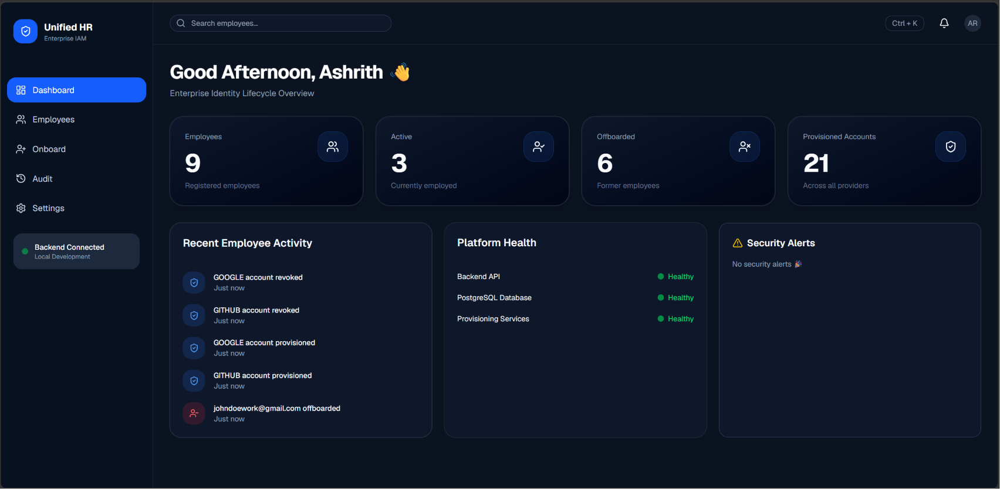
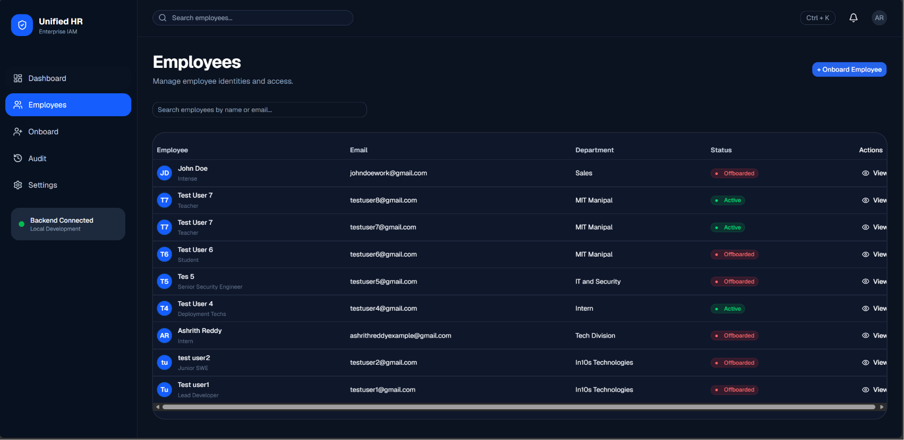
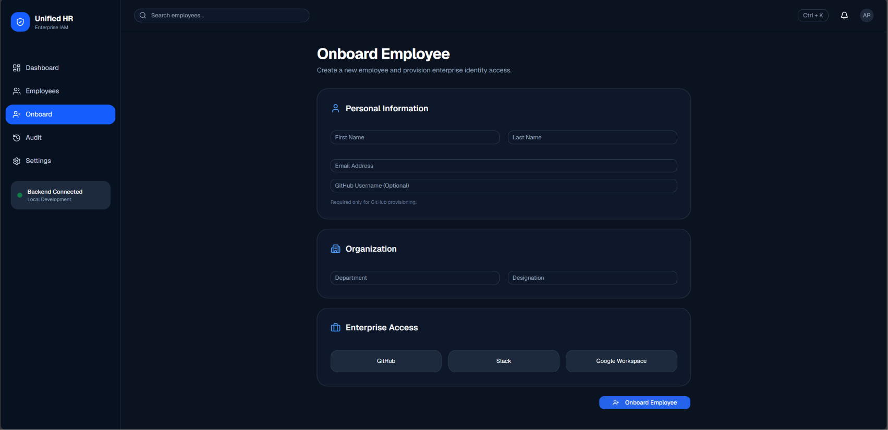
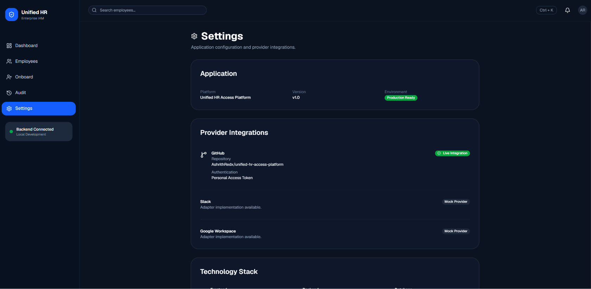
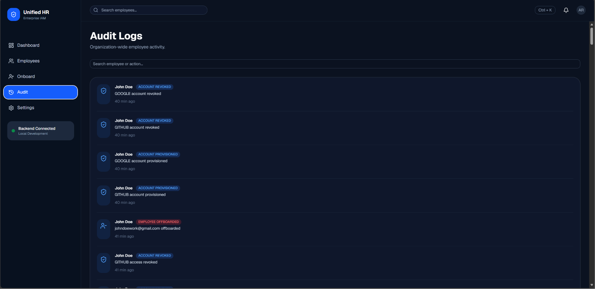

# Unified HR Access Platform

A full-stack HR access management platform that automates employee onboarding, access provisioning, and offboarding through a clean, extensible architecture.

Built as part of an internship project to demonstrate modern backend architecture, provider integrations, audit logging, and secure employee lifecycle management.

---

## 🚀 Features

### Employee Lifecycle Management
- Create and manage employee profiles
- Track employment status (Active / Offboarded)
- View detailed employee information
- Department and designation management

### Access Provisioning
- Provision employee access to external services
- Revoke access when no longer required
- Support for multiple providers using the Adapter Pattern

### GitHub Integration (Live)
- Invite employees as collaborators to a GitHub repository
- Remove collaborators automatically
- Uses the official GitHub REST API
- Real-time provisioning status updates

### Mock Provider Integrations
- Slack
- Google Workspace

These providers demonstrate the platform's extensible architecture while avoiding enterprise API requirements.

### Audit Logging
Every important action is recorded, including:
- Employee onboarding
- Access provisioning
- Access revocation
- Employee offboarding

### Dashboard
- Employee statistics
- Provisioned account count
- Security alerts
- Recent activity overview

---

## 🌐 Live Demo

- Frontend: https://unified-hr-access-platform.vercel.app/
- Backend API: https://dashboard.render.com/web/srv-d9ahjnucjfls739ei9t0

# 🏗 Architecture

The application follows a layered architecture with clear separation of concerns.

```
Frontend (React)

        │

        ▼

REST API (FastAPI)

        │

        ▼

Business Services

        │

        ▼

Repositories

        │

        ▼

Provider Adapters

        │

        ▼

External Services
(GitHub / Slack / Google Workspace)
```

---

## Adapter Pattern

Each provider implements a common interface.

```
AccessProvider
      │
      ├── GitHubAdapter (Live)
      ├── SlackAdapter (Mock)
      └── GoogleWorkspaceAdapter (Mock)
```

This allows new providers to be added without modifying existing business logic.

---

# 🛠 Tech Stack

## Frontend

- React
- TypeScript
- Vite
- Tailwind CSS
- React Router
- Axios
- Lucide Icons

## Backend

- FastAPI
- SQLAlchemy
- Alembic
- PostgreSQL
- Pydantic v2

## External APIs

- GitHub REST API

---

# 📂 Project Structure

```
backend/
│
├── app/
│   ├── api/
│   ├── core/
│   ├── database/
│   ├── models/
│   ├── repositories/
│   ├── schemas/
│   ├── services/
│   ├── adapters/
│   └── main.py
│
└── alembic/

frontend/
│
├── src/
│   ├── components/
│   ├── pages/
│   ├── services/
│   ├── types/
│   └── App.tsx
```

---

# ⚙ Environment Variables

Backend requires the following environment variables:

```env
DATABASE_URL=postgresql://...

GITHUB_TOKEN=your_personal_access_token

GITHUB_OWNER=your_github_username

GITHUB_REPO=repository_name
```

---

# 🗄 Database

The project uses:

- PostgreSQL
- SQLAlchemy ORM
- Alembic migrations

Run migrations:

```bash
alembic upgrade head
```

---

# ▶ Running Locally

## Backend

```bash
cd backend

python -m venv .venv

source .venv/bin/activate
# Windows
# .venv\Scripts\activate

pip install -r requirements.txt

alembic upgrade head

uvicorn app.main:app --reload
```

Backend runs at:

```
http://localhost:8000
```

---

## Frontend

```bash
cd frontend

npm install

npm run dev
```

Frontend runs at:

```
http://localhost:5173
```

---

# 🔄 Employee Workflow

## Onboarding

1. Create employee
2. Employee appears in dashboard
3. Access providers available

---

## Provision GitHub Access

```
Employee

↓

Provision GitHub

↓

GitHub REST API

↓

Repository Invitation

↓

Audit Log Updated
```

---

## Revoke Access

```
Employee

↓

Revoke GitHub

↓

Collaborator Removed

↓

Audit Log Updated
```

---

## Offboarding

```
Employee Offboarded

↓

All Access Revoked

↓

Status Updated

↓

Audit Logged
```

---

# 📷 Screenshots

## Dashboard



---

## Employee List



---

## Onboarding Employee



---

## Settings



---

## Audit Timeline



---


# 🔐 Security

- Secrets are managed through environment variables.
- GitHub Personal Access Tokens are never committed.
- Database credentials are excluded from version control.

---

# 📈 Future Improvements

- Microsoft Entra ID integration
- Okta integration
- Azure Active Directory support
- Role-based access control (RBAC)
- Email notifications
- Bulk employee import
- SSO support
- Background task queue (Celery/RQ)
- Real-time notifications
- Unit and integration tests

---

# 👨‍💻 Author

**Ashrith Reddy**

- GitHub: https://github.com/AshrithRedx

---

# 📄 License

This project was developed as part of an internship assignment and is intended for educational and demonstration purposes.
